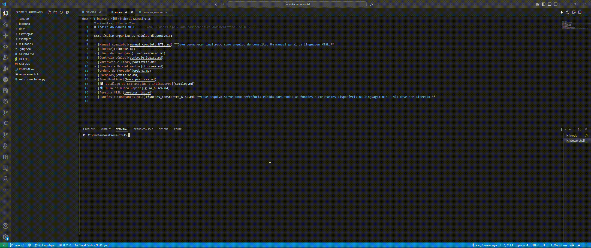

# NTSL-Toolkit: Framework de Desenvolvimento de Estratégias com IA

**Framework open-source para criação, orquestração e análise de estratégias de trading em NTSL, com suporte a IA (Gemini) e integração com Profit Pro.**  
💡 Uma solução que normalmente é cara no mercado, agora disponível gratuitamente para estudo e colaboração da comunidade.

[](LICENSE)

[](https://nubank.com.br/cobrar/4oage/68d559b8-fc76-4093-988e-5c4fe7dbecc4)

---

## ⚠️ Aviso Legal Importante

Este projeto e todas as estratégias, códigos e análises contidas nele são fornecidos para **fins estritamente educacionais e de pesquisa**. **Isto NÃO é uma recomendação de investimento.**

Operar no mercado financeiro envolve riscos elevados, incluindo a perda total do capital investido.  
Os resultados de backtests são baseados em dados históricos e **não garantem performance futura**.

**Use por sua conta e risco.**

---

## 🚀 Demo Rápido

Veja como é simples rodar uma estratégia:



---

## 🎯 O Conceito do Projeto

Este não é apenas um repositório de scripts, mas um **framework de desenvolvimento assistido por IA**, que conecta trading, NTSL e automação.  

Fluxo principal:
1. **Agente de IA Especialista:** Gemini assume a persona **Trader-Dev NTSL** (definida em `GEMINI.md`).
2. **Base de Conhecimento:** Documentação (`docs/`) + catálogo de exemplos (`docs/catalog.md`).
3. **Desenvolvimento Orquestrado:** Estratégias robustas em `estrategias/automations/`.
4. **Validação:** Backtests em Python com relatórios e gráficos (`docs/imgs/`).
5. **Objetivo Final:** Prototipar em NTSL → traduzir para Python → integrar ao Profit Pro.

---

## ✨ Showcase: Resultados do Orquestrador

Exemplos reais de estratégias construídas com o framework:

### `orquestrador_moderado_5_preciso`


### `orquestrador_moderado_7_consistente`


---

## 🏗️ Estrutura do Projeto

- `estrategias/`: coração do projeto  
  - `automations/`: estratégias orquestradoras  
  - `exemplos/`: scripts NTSL editáveis  
- `docs/`: documentação completa  
  - `catalog.md`: catálogo de estratégias  
  - `manual_completo_NTSL.md`: referência da linguagem  
  - `imgs/`: resultados e execuções  
- `backtest/`: motor de backtest em Python  
- `GEMINI.md`: persona do agente IA  
- `Makefile`: atalhos de instalação e execução  

---

## 🔧 Guia de Uso

1. **Instalação**
   ```sh
   make install
   ```

2. **Rodar backtest rápido**
   ```sh
   make batch STRATEGY=orquestrador_moderado_7_consistente.txt DATA=WINFUT_F_0_1min.csv
   ```

3. **Teste interativo**
   ```sh
   make test
   ```

Mais detalhes no [README original](README.md).

---

## ❤️ Como Contribuir

Este é um projeto open-source, e toda forma de contribuição é bem-vinda:

- 💻 **Código:** fork + branch + pull request  
- 💡 **Ideias:** abra issues com sugestões  
- ☕ **Apoio:** se o projeto te ajudou, considere me pagar um café via [PIX](https://nubank.com.br/cobrar/4oage/68d559b8-fc76-4093-988e-5c4fe7dbecc4)

---

## 📜 Licença

Distribuído sob licença **MIT**.  
Consulte o arquivo [LICENSE](LICENSE) para mais detalhes.