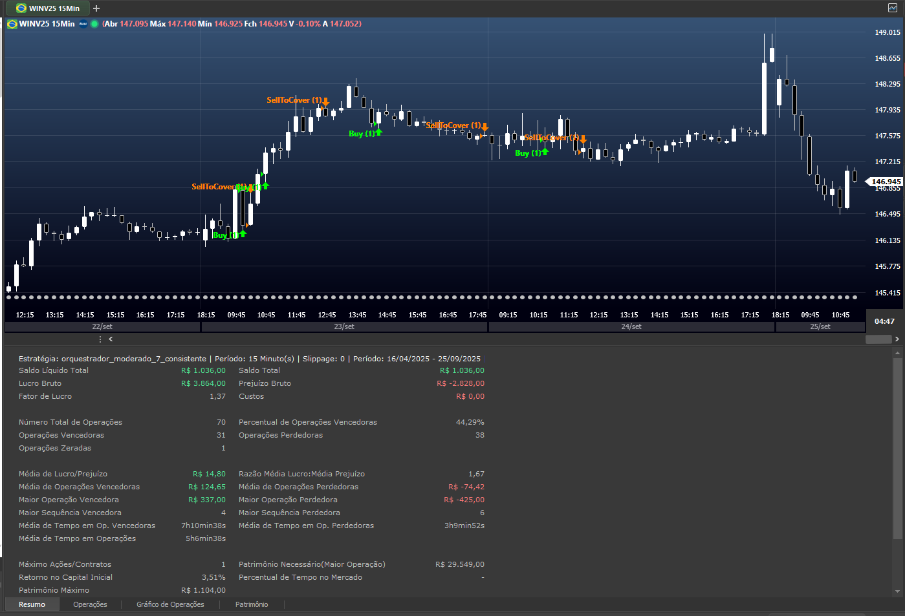
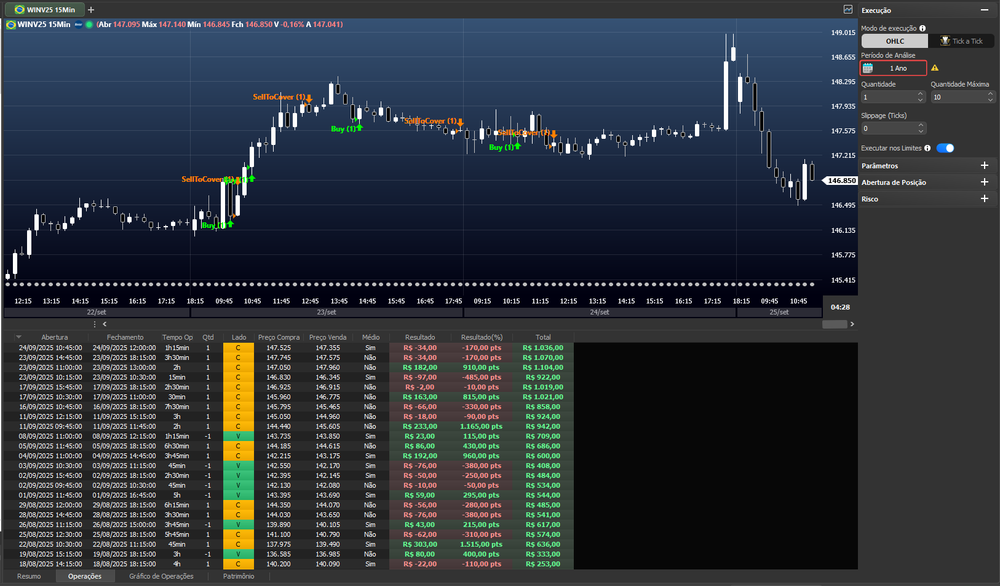
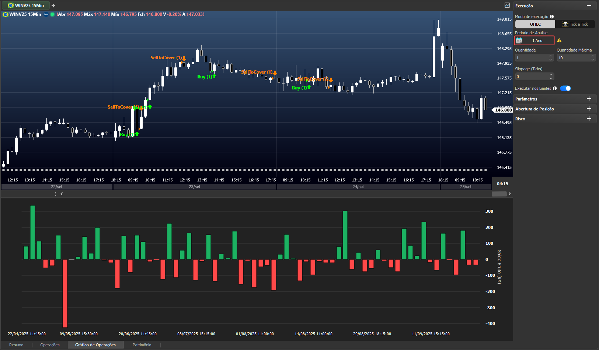
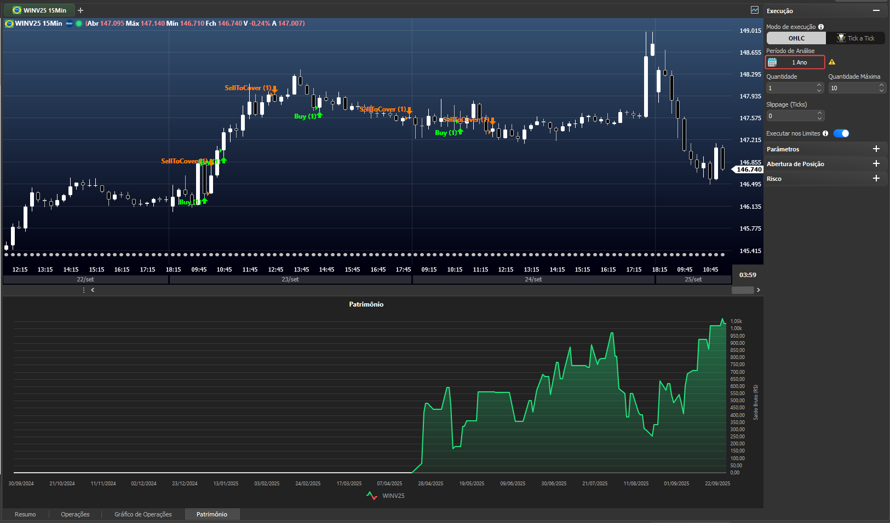
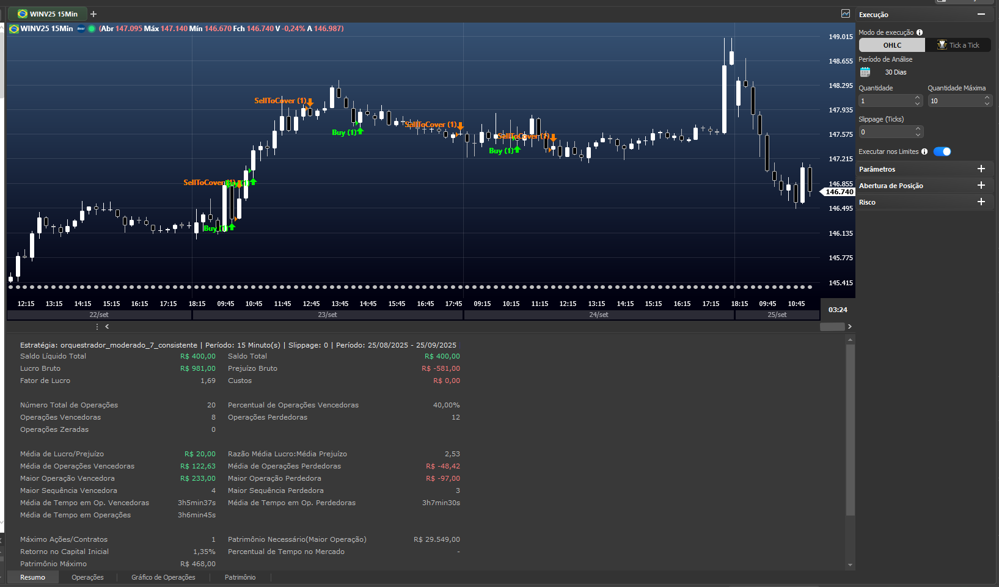
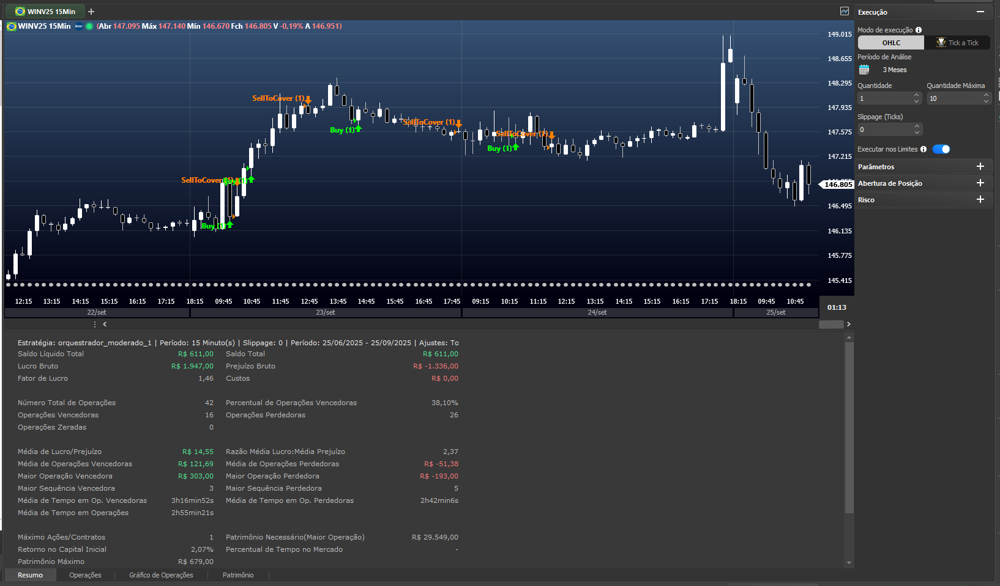
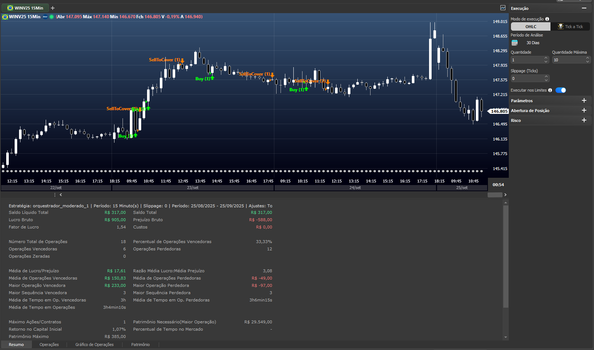

# NTSL-Toolkit: Framework de Desenvolvimento de Estratégias com IA

**Um ecossistema completo para o desenvolvimento, orquestração e análise de estratégias de trading em NTSL, assistido pela IA Gemini, com o objetivo final de tradução para Python e integração com o módulo de automação do Profit (Nelogica).**

---

## ⚠️ Aviso Legal Importante

Este projeto e todas as estratégias, códigos e análises contidas nele são fornecidos para **fins estritamente educacionais e de pesquisa**. **Isto NÃO é uma recomendação de investimento.**

Operar no mercado financeiro envolve altos riscos, incluindo a possibilidade de perda total do capital investido. Os resultados de backtests apresentados neste repositório são baseados em dados históricos e **não garantem performance futura**. Não me responsabilizo por quaisquer perdas financeiras resultantes do uso, direto ou indireto, das informações aqui contidas.

**Use por sua conta e risco.**

---

## 🎯 O Conceito do Projeto

Este não é apenas um repositório de scripts, mas um **framework de desenvolvimento assistido por IA**. O fluxo de trabalho foi desenhado para ser uma colaboração entre o desenvolvedor/trader e um agente de IA (Gemini), seguindo estes passos:

1.  **Agente de IA Especialista:** O Gemini assume a persona **Trader-Dev NTSL** (definida em `GEMINI.md`), um especialista em NTSL, análise técnica e gestão de risco.
2.  **Base de Conhecimento:** A IA utiliza a rica documentação (`docs/`) e o vasto catálogo de exemplos (`docs/catalog.md`) como sua principal fonte de conhecimento para entender, combinar e criar lógicas de trading.
3.  **Desenvolvimento Orquestrado:** O objetivo é criar "estratégias orquestradoras" robustas, como as encontradas em `estrategias/automations/`. Elas combinam múltiplos sinais e filtros para tomar decisões de trading mais inteligentes.
4.  **Validação e Resultados:** As estratégias criadas são testadas, e seus resultados (curva de capital, estatísticas) são armazenados como imagens em `docs/imgs/` para validação visual.
5.  **Objetivo Final:** A lógica NTSL validada serve como um protótipo claro para a tradução para **Python**, visando a integração com o **módulo de automação do Profit (Nelogica)**.

## ✨ Showcase: Resultados do Orquestrador

Os resultados abaixo foram gerados pelas estratégias `orquestrador_moderado_5_preciso.txt` e `orquestrador_moderado_7_consistente.txt`, que são exemplos práticos do que pode ser construído com este framework.

### Resultados para `orquestrador_moderado_5_preciso`





### Resultados para `orquestrador_moderado_7_consistente`






---

## 🚀 Guia de Uso e Workflow

### ⚠️ Sobre o Backtest Local

O motor de backtest em `backtest/` foi criado para validar a lógica estrutural das estratégias NTSL em Python. No entanto, ele **não reproduz com 100% de fidelidade** os resultados da plataforma Nelogica, pois a plataforma possui cálculos proprietários e regras de negócio específicas que não são publicamente documentadas.

Use este backtest como uma **ferramenta de prototipagem rápida** para desenvolver e iterar sobre a lógica. O teste final e oficial de qualquer estratégia deve ser sempre realizado na plataforma de origem.

### 1. Preparando os Dados de Mercado

Para realizar os backtests, você precisa de dados históricos em formato CSV.

1.  **Obtenha os Dados:** Exporte os dados históricos do ativo desejado diretamente da plataforma Profit Pro. Você pode exportar em qualquer tempo gráfico (ex: 1 minuto, 5 minutos).
2.  **Armazene os Dados:** Coloque o arquivo `.csv` gerado dentro da pasta `backtest/dados/`.

O sistema de backtest consegue ler os dados e reamostrá-los para o tempo gráfico que você desejar testar.

### 2. Instalação

O `Makefile` simplifica a configuração do ambiente. Para instalar as dependências e preparar o projeto, execute:

```sh
make install
```

### 3. Desenvolvendo Estratégias com a IA (Gemini CLI)

A principal forma de interagir com este projeto é através de diálogo com o agente Gemini. Forneça instruções claras e utilize o contexto dos arquivos do projeto.

**Exemplos de Prompts Eficazes:**

> "Analise a estratégia `estrategias/exemplos/editaveis/rompimento/BollingerBreakout.txt` e adicione um filtro de volume, onde a entrada só é permitida se o volume do candle de sinal for 50% maior que a média de volume dos últimos 20 candles."

> "Baseado no `docs/catalog.md`, crie uma nova estratégia orquestradora em `estrategias/automations/` que combine o setup 'Primeira Barra' com o 'Cruzamento de Médias', dando peso de 60% para o primeiro e 40% para o segundo."

> "Refatore o arquivo `estrategias/automations/orquestrador_moderado_5_preciso.txt` para incluir uma lógica de trailing stop com base no indicador ATR, conforme descrito em `docs/funcoes_constantes_NTSL.md`."

### 4. Executando o Backtest Local

Existem duas formas principais de executar um backtest:

**Método A: Via `Makefile` (Recomendado para rapidez)**

O `Makefile` oferece comandos prontos para as tarefas mais comuns.

-   **Listar estratégias e dados disponíveis:**
    ```sh
    make list-strategies
    make list-data
    ```

-   **Executar um backtest em modo batch (não interativo):**
    ```sh
    make batch STRATEGY=orquestrador_moderado_7_consistente.txt DATA=WINFUT_F_0_1min.csv
    ```

-   **Executar um teste interativo (guiado pelo console):**
    ```sh
    make test
    ```

**Método B: Via Script Direto (Para depuração e controle)**

Para um controle mais granular, você pode editar e executar o script `examples/example_backtest.py` diretamente.

1.  **Edite o arquivo:** Abra `examples/example_backtest.py` e ajuste as variáveis no topo do arquivo para apontar para a estratégia e os dados que deseja testar.
2.  **Execute o script:**
    ```sh
    python examples/example_backtest.py
    ```

### 5. Análise e Iteração

Analise os resultados gerados (relatórios em Excel, gráficos de equity). Com base nos insights, inicie um novo ciclo de desenvolvimento, refinando a estratégia com novos prompts para a IA.

---

## 🏛️ Componentes do Ecossistema

-   `estrategias/`: Contém o coração do projeto.
    -   `automations/`: Estratégias "orquestradoras" completas e prontas para backtest.
    -   `exemplos/`: Uma vasta coleção de scripts NTSL (indicadores e automações) que servem como blocos de construção.
-   `docs/`: A base de conhecimento do projeto.
    -   `catalog.md`: Um catálogo detalhado de todos os scripts em `estrategias/exemplos/`, essencial para a IA.
    -   `manual_completo_NTSL.md`: A referência completa da linguagem.
    -   `imgs/`: Imagens e prints dos resultados dos backtests.
    -   Outros arquivos `.md`: Guias de sintaxe, boas práticas, fluxo de execução, etc.
-   `backtest/`: Módulos em Python que formam o motor de backtesting local e o parser NTSL.
-   `GEMINI.md`: O "prompt de sistema" que define a persona, as regras e o contexto para a IA Gemini operar neste projeto.
-   `Makefile`: Arquivo com atalhos para automatizar tarefas como instalação e execução de testes.
-   `LICENSE`: A licença MIT do projeto.

## ❤️ Como Contribuir

Este é um projeto open-source. Se você acredita neste trabalho e quer apoiar sua continuidade, considere contribuir:

**1. Contribuição com Código:**
   - Faça um fork do repositório.
   - Crie uma nova branch para sua feature ou correção.
   - Abra um Pull Request detalhando suas mudanças.

**2. Contribuição Financeira:**
   Se você gostaria de apoiar o projeto financeiramente, pode fazer uma doação através do link abaixo. Qualquer valor ajuda a custear o tempo e os recursos dedicados ao desenvolvimento.

   [](https://nubank.com.br/cobrar/4oage/68d559b8-fc76-4093-988e-5c4fe7dbecc4)

## 📜 Licença

Este projeto é distribuído sob a licença **MIT**. Veja o arquivo `LICENSE` para mais detalhes.
